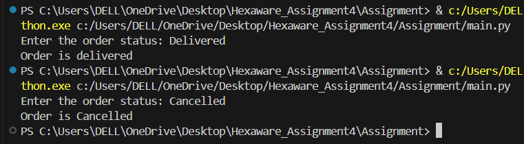
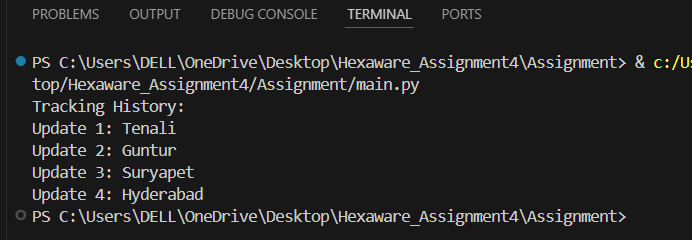

<h1>Coding</h1>
<h3>Task 1: Control Flow Statements </h3>

> 1. Write a program that checks whether a given order is delivered or not based on its status (e.g., 
"Processing," "Delivered," "Cancelled"). Use if-else statements for this.

```python
def checkStatus(status):
   if status=='Delivered':
    print('Order delivered')
   elif status=='Processing':
    print('Order is processing')
   elif status=='Cancelled':
    print('Order is Cancelled')
   else:
    print('Unknown Status')
status=input('Enter the order status: ')
checkStatus(status)
```


> 2. Implement a switch-case statement to categorize parcels based on their weight into "Light," 
"Medium," or "Heavy." 

```python
def detectWeiht(weight):
    match weight:
      case w if w<10:
        return 'Light'
      case w if w>=10 and w<50:
       return 'Medium'
      case default:
       return 'Heavy'
weight=int(input('Enter the weight of parcel: '))
print(detectWeiht(weight))
```


> 3. Implement User Authentication 1. Create a login system for employees and customers using Java 
control flow statements. 

```python
employeeDetails = {
 "Satwika":"satwika123",
 "Shiva":"shiva123"
}
customerDetails = {
 "Surya":"surya123",
 "Satya":"satya123"
}
def login():
   loginType = int(input('Enter your role\n 1.Employee\n 2.Customer\n'))
   name = input('Enter username: ')
   password = input('Enter password: ')
   if loginType==1:
     if name in employeeDetails and password == employeeDetails[name]:
       print(f'Welcome back {name}!')
     else:
       print('Invalid username or password')
   elif loginType == 2:
     if name in customerDetails and password == customerDetails[name]:
       print(f'Welcome back {name}!')
     else:
       print(f'Invalid username or password')
login()
```


> 4. Implement Courier Assignment Logic 1. Develop a mechanism to assign couriers to shipments based 
on predefined criteria (e.g., proximity, load capacity) using loops.

```python
couriers = [
    {"name": "Courier 1", "load_capacity": 50},
    {"name": "Courier 2", "load_capacity": 100},
    {"name": "Courier 3", "load_capacity": 150}
]

def assignment_courier(ship_weight):
    for courier in couriers:
        if courier["load_capacity"] >= ship_weight:
            return courier["name"]
    return "No courier found with suitable load capacity"

ship_weight = float(input("Enter ship weight: "))
result = assignment_courier(ship_weight)
print("Assigned courier:", result)

```


<h3>Task 2: Loops and Iteration</h3>

> 5. Write a Java program that uses a for loop to display all the orders for a specific customer. 

```python
orders=[
    {"order_id":1,"customer":"Shiva"},
    {"order_id":2,"customer":"Anika"},
    {"order_id":3,"customer":"Shiva"},
    {"order_id":4,"customer":"Arjun"},
    {"order_id":5,"customer":"Shiva"},
    {"order_id":6,"customer":"Varun"},
]

def orders_customer(customer):
    print(f"Orders for Customer {customer}:")
    for order in orders:
        if order["customer"] == customer:
            print(f"Order ID: {order['order_id']}")

customer=input("Enter specific customer name:")
orders_customer(customer)

```


> 6. Implement a while loop to track the real-time location of a courier until it reaches its destination.

```python
import time

def track_courier(destination):
    current_location = "Tenali"
    print(f"The courier is currently at: {current_location}")

    while current_location != destination:
    
        if current_location == "Tenali":
            current_location = "Guntur"
        elif current_location == "Guntur":
            current_location = "Suryapet"
        elif current_location == "Suryapet":
            current_location = "Hyderabad"
        time.sleep(1) 
        print(f"The courier is currently at: {current_location}")

    print("The courier has reached its destination!")

destination = input("Enter destination:")
track_courier(destination)
```


<h3> Task 3: Arrays and Data Structures </h3>

> 7. Create an array to store the tracking history of a parcel, where each entry represents a location 
update. 
```python
tracking_history = []
updates = ["Tenali", "Guntur", "Suryapet", "Hyderabad"]
for i in range(len(updates)):
 tracking_history.append(updates[i])
print("Tracking History:")
for i in range(len(tracking_history)):
 print(f"Update {i+1}: {tracking_history[i]}")
```


> 8. Implement a method to find the nearest available courier for a new order using an array of couriers.
```python
def nearest_courier(pickup, couriers):
 nearest = None
 min_dist = float('inf')
 for courier in couriers:
   difference = abs(pickup - courier['distance'])
   if difference < min_dist:
    min_dist = difference
    nearest = courier['distance']
    location=courier['name']
 return nearest,location
 
couriers = [
    {"name": "Courier 1", "distance": 10},
    {"name": "Courier 2", "distance": 20},
    {"name": "Courier 3", "distance": 30}
]

new_order = int(input("Enter new order location:"))
result = nearest_courier(new_order, couriers)
print(f'Nearest Courier number : {result[0]} and courier name : {result[1]}')
```


<h3> Task 4: Strings,2d Arrays, user defined functions,Hashmap </h3>

> 9. Parcel Tracking: Create a program that allows users to input a parcel tracking number.Store the 
tracking number and Status in 2d String Array. Initialize the array with values. Then, simulate the 
tracking process by displaying messages like "Parcel in transit," "Parcel out for delivery," or "Parcel 
delivered" based on the tracking number's status. 

```python
parcel_tracking=[[1,"Parcel in transit"],[2,"Parcel out for delivery"],[3,"Parcel delivered"]]
tracking_number=int(input("Enter your parcel Id:"))
for parcel in parcel_tracking:
 if parcel[0]==tracking_number:
   print("Parcel Status:",parcel[1])
   break
```


> 10. Customer Data Validation: Write a function which takes 2 parameters, data-denotes the data and 
detail-denotes if it is name addtress or phone number.Validate customer information based on 
following critirea. Ensure that names contain only letters and are properly capitalized, addresses do not 
contain special characters, and phone numbers follow a specific format (e.g., ###-###-####). 

```python
import re;
def data_Validation(data,detail):
   if(detail=="name"):
     if(data.isalpha() and data.istitle()):
       print(data," is valid name")
     else:
       print("Invalid ",detail)

   elif(detail=="address"):
     if(data.isalnum()):
       print(data, " is valid address")
     else:
       print("Invalid ",detail)
 
   elif(detail=='phone_number'):
     pattern = r'\d{3}-\d{3}-\d{4}'
     if re.match(pattern, data):
       print(data, " is valid number")
     else:
       print("Invalid",detail)

   else:
     print("Invalid detail")

detail = input("Enter type of data: ")
data = input("Enter "+ detail+": ")
data_Validation(data,detail)
```


> 11. Address Formatting: Develop a function that takes an address as input (street, city, state, zip code) 
and formats it correctly, including capitalizing the first letter of each word and properly formatting the 
zip code. 

```python
def format_Address(street,city,state,zip):
 result = ""
 result += street+", "+city+", "+state+", "+str(zip)
 result = result.title()
 return result

street=input("Enter street:")
city=input("Enter city:")
state=input("Enter state:")
zip=int(input("Enter zip:"))

print(f'Address: {format_Address(street,city,state,zip)}')
```


> 12. Order Confirmation Email: Create a program that generates an order confirmation email. The email 
should include details such as the customer's name, order number, delivery address, and expected 
delivery date. 
```python
def order_Confirmation(name,orderDate,address,expectedDate):
 emailContent = f"""
 Dear {name},
 Thank you for your order! Below are the details of your purchase:
 
 Order Number: {orderDate}
 Delivery Address: {address}
 Expected Delivery Date: {expectedDate}

 If you have any questions or concerns, feel free to contact us.
 Sincerely,
 FastDelivery courier company
 """
 return emailContent

name=input("Enter name:")
orderId=int(input("Enter orderId:"))
address=input("Enter address:")
expectedDate=input("Enter expected delivery date:")
print(order_Confirmation(name,orderId,address,expectedDate))
```


> 13. Calculate Shipping Costs: Develop a function that calculates the shipping cost based on the distance 
between two locations and the weight of the parcel. You can use string inputs for the source and 
destination addresses. 
```python
def shipping_cost(distance,weight):
    cost=0
    cost_per_km=5
    cost_per_kg=5
    total_cost=cost+(cost_per_km*distance)+(cost_per_kg*weight)
    return total_cost

distance=float(input("Enter distance between source and destination:"))
weight=float(input("Enter weight of parcel:"))
source=input("Enter source:")
destination=input("Enter destination:")
cost_parcel=shipping_cost(distance,weight)
print(f"Shipping cost of parcel from {source} to {destination} is {cost_parcel}")
```


> 14. Password Generator: Create a function that generates secure passwords for courier system 
accounts. Ensure the passwords contain a mix of uppercase letters, lowercase letters, numbers, and special characters. 
```python
import string
import random

def generate_password(length=8):
 letters = string.ascii_letters
 digits = string.digits
 special = string.punctuation
 characters = letters + digits + special
 password = ''.join(random.choices(characters, k=length))
 return password

password = generate_password()
print("Generated Password:", password)
```


> 15. Find Similar Addresses: Implement a function that finds similar addresses in the system. This can be 
useful for identifying duplicate customer entries or optimizing delivery routes.Use string functions to 
implement this.
```python
def find_similar(address,target):
    similar_address=[]
    for add in address:
        if target.lower() in add.lower():
            similar_address.append(add)
    return similar_address

address=[
    '123 Main Street,Varanasi,1002',
    '456 Oak Street,Kerala,1003',
    '123 Main Street,Srisailam,1004',
    '789 Elm Street,Jaipur,1005'
]

target=input("Enter target:")
similar=find_similar(address,target)
print('Similar Address:',similar)
```


<h3> Task 5: Object Oriented Programming </h3>

Scope : Entity classes/Models/POJO, Abstraction/Encapsulation 
Create the following model/entity classes within package entities with variables declared 
private, constructors(default and parametrized,getters,setters and toString()) 

> 1. User Class: 
Variables:
userID , userName , email , password , contactNumber , address

```python
class User:
 def __init__(self,UserID,Name,Email,Password,ContactNumber,Address):
   self.UserID = UserID
   self.Name = Name
   self.Email = Email
   self.Password = Password
   self.ContactNumber = ContactNumber
   self.Address = Address
   
 # Getters
 def get_UserID(self):
   return self.UserID
 
 def get_Name(self):
   return self.Name
 
 def get_Email(self):
   return self.Email
 
 def get_Password(self):
   return self.Password
 
 def get_ContactNumber(self):
   return self.ContactNumber
 
 def get_Address(self):
   return self.Address
 
 # Setters
 def set_UserID(self, UserID):
   self.UserID = UserID

 def set_Name(self, Name):
   self.Name = Name

 def set_Email(self, Email):
   self.Email = Email

 def set_Password(self, Password):
   self.Password = Password

 def set_ContactNumber(self, ContactNumber):
   self.ContactNumber = ContactNumber

 def set_address(self, Address):
   self.Address = Address

```
> 2. Courier Class
Variables: courierID , senderName , senderAddress , receiverName , receiverAddress , weight , 
status, trackingNumber , deliveryDate ,userId
```python
class Courier:
    def __init__(self, CourierID, UserID, SenderName, SenderAddress, ReceiverName, ReceiverAddress, Weight, Status, TrackingNumber, DeliveryDate):
        self.CourierID = CourierID
        self.UserID = UserID
        self.SenderName = SenderName
        self.SenderAddress = SenderAddress
        self.ReceiverName = ReceiverName
        self.ReceiverAddress = ReceiverAddress
        self.Weight = Weight
        self.Status = Status
        self.TrackingNumber = TrackingNumber
        self.DeliveryDate = DeliveryDate

    # Getters
    def getCourierID(self):
        return self.CourierID

    def getUserID(self):
        return self.UserID

    def getSenderName(self):
        return self.SenderName

    def getSenderAddress(self):
        return self.SenderAddress

    def getReceiverName(self):
        return self.ReceiverName

    def getReceiverAddress(self):
        return self.ReceiverAddress

    def getWeight(self):
        return self.Weight

    def getStatus(self):
        return self.Status

    def getTrackingNumber(self):
        return self.TrackingNumber

    def getDeliveryDate(self):
        return self.DeliveryDate

    # Setters
    def setCourierID(self, CourierID):
        self.CourierID = CourierID

    def setUserID(self, UserID):
        self.UserID = UserID

    def setSenderName(self, SenderName):
        self.SenderName = SenderName

    def setSenderAddress(self, SenderAddress):
        self.SenderAddress = SenderAddress

    def setReceiverName(self, ReceiverName):
        self.ReceiverName = ReceiverName

    def setReceiverAddress(self, ReceiverAddress):
        self.ReceiverAddress = ReceiverAddress

    def setWeight(self, Weight):
        self.Weight = Weight

    def setStatus(self, Status):
        self.Status = Status  

    def setTrackingNumber(self, TrackingNumber):
        self.TrackingNumber = TrackingNumber

    def setDeliveryDate(self, DeliveryDate):
        self.DeliveryDate = DeliveryDate 


```

> 3. Employee Class:
Variables employeeID , employeeName , email , contactNumber , role String, salary 
```python
class Employee:
   def __init__(self,EmployeeID, Name, Email, ContactNumber, Role, Salary):
     self.EmployeeID = EmployeeID
     self.Name = Name
     self.Email = Email
     self.ContactNumber = ContactNumber
     self.Role = Role
     self.Salary = Salary

 # Getters
   def get_EmployeeID(self):
     return self.EmployeeID

   def get_Name(self):
     return self.Name

   def get_Email(self):
      return self.Email

   def get_ContactNumber(self):
     return self.ContactNumber

   def get_Role(self):
      return self.Role

   def get_Salary(self):
      return self.Salary

 # Setters
   def set_EmployeeID(self, EmployeeID):
      self.EmployeeID = EmployeeID

   def set_Name(self, Name):
      self.Name = Name

   def set_Email(self, Email):
      self.Email = Email
 
   def set_ContactNumber(self, ContactNumber):
      self.ContactNumber = ContactNumber

   def set_Role(self, Role):
     self.Role = Role

   def set_Salary(self, Salary):
     self.Salary = Salary

```

> 4. Location Class
Variables LocationID , LocationName , Address

```python
class Location:
 def __init__(self,LocationID, LocationName, Address ):
   self.LocationID = LocationID
   self.LocationName = LocationName
   self.Address = Address
 # Getters
def get_LocationID(self):
 return self.LocationID

def get_LocationName(self):
 return self.LocationName

def get_Address(self):
 return self.Address

# Setters
def set_LocationID(self, LocationID):
 self.LocationID = LocationID

def set_LocationName(self, LocationName):
 self.LocationName = LocationName

def set_Address(self, Address):
 self.Address = Address

```

> 5. CourierCompany Class
Variables companyName , courierDetails -collection of Courier Objects, employeeDetailscollection of Employee Objects, locationDetails - collection of Location Objects.

```python
class CourierCompany:
   def __init__(self, companyName, courierDetails, employeeDetails, locationDetails):
     self.companyName = companyName
     self.courierDetails = courierDetails
     self.employeeDetails = employeeDetails
     self.locationDetails = locationDetails

 # Getters
def get_companyName(self):
 return self.companyName

def get_courierDetails(self):
 return self.courierDetails

def get_employeeDetails(self):
 return self.employeeDetails

def get_locationDetails(self):
 return self.locationDetails

 # Setters
def set_companyName(self, companyName):
 self.companyName = companyName

def set_courierDetails(self, courierDetails):
 self.courierDetails = courierDetails

def set_employeeDetails(self, employeeDetails):
 self.employeeDetails = employeeDetails

def set_locationDetails(self, locationDetails):
 self.locationDetails = locationDetails
```

> 6. Payment Class: 
Variables PaymentID long, CourierID long, Amount double, PaymentDate Date
```python
class Payment:
   def __init__(self,PaymentID, CourierID, LocationId, Amount, PaymentDate):
     self.PaymentID = PaymentID
     self.CourierID = CourierID
     self.LocationID = LocationId
     self.Amount = Amount
     self.PaymentDate = PaymentDate
 # Getters
def get_PaymentID(self):
 return self.PaymentID

def get_CourierID(self):
 return self.CourierID

def get_LocationId(self):
 return self.LocationId

def get_Amount(self):
 return self.Amount

def get_PaymentDate(self):
 return self.PaymentDate

 # Setters
def set_PaymentID(self, PaymentID):
 self.PaymentID = PaymentID

def set_CourierID(self, CourierID):
 self.CourierID = CourierID

def set_LocationId(self, LocationId):
 self.LocationId = LocationId

def set_Amount(self, Amount):
 self.Amount = Amount

def set_PaymentDate(self, PaymentDate):
 self.PaymentDate = PaymentDate
```


<h3> Task 6: Service Provider Interface /Abstract class </h3>
 Create 2 Interface /Abstract class ICourierUserService and ICourierAdminService interface 

> 1 . ICourierUserService 
// Customer-related functions 
placeOrder()
/** Place a new courier order. 
* @param courierObj Courier object created using values entered by users 
* @return The unique tracking number for the courier order .
Use a static variable to generate unique tracking number. Initialize the static variable in Courier 
class with some random value. Increment the static variable each time in the constructor to 
generate next values. 
getOrderStatus();
/**Get the status of a courier order. 
*@param trackingNumber The tracking number of the courier order. 
* @return The status of the courier order (e.g., yetToTransit, In Transit, Delivered). 
*/ 
cancelOrder()
/** Cancel a courier order. 
* @param trackingNumber The tracking number of the courier order to be canceled. 
* @return True if the order was successfully canceled, false otherwise.*/
getAssignedOrder(); 
/** Get a list of orders assigned to a specific courier staff member 
* @param courierStaffId The ID of the courier staff member. 
* @return A list of courier orders assigned to the staff member.*/ 
// Admin functions 
```python
from abc import ABC, abstractmethod

class ICourierUserService(ABC):

    @abstractmethod
    def placeOrder(self,courierObj):
        pass

    @abstractmethod
    def getOrderStatus(self, trackingNumber):
        pass

    @abstractmethod
    def cancelOrder(self, trackingNumber: str):
        pass

    @abstractmethod
    def getAssignedOrder(self, courierStaffId):
        pass
```

> 2 . ICourierAdminService
int addCourierStaff(Employee obj); 
/** Add a new courier staff member to the system. 
* @param name The name of the courier staff member. 
* @param contactNumber The contact number of the courier staff member. 
* @return The ID of the newly added courier staff member. 
*/

```python
from abc import ABC, abstractmethod

class ICourierAdminService(ABC):

    @abstractmethod
    def addCourierStaff(self, employee):
        pass

```

<h3> Task 7: Exception Handling </h3>
(Scope: User Defined Exception/Checked /Unchecked Exception/Exception handling using try..catch 
finally,thow & throws keyword usage) 
Define the following custom exceptions and throw them in methods whenever needed . Handle all the 
excpetionsin main method, 

> 1. TrackingNumberNotFoundException :throw this exception when user try to withdraw amount or 
transfer amount to another account
```python
class TrackingNumberNotFoundException(Exception):
     def __init__(self, TrackingNumber):
        super().__init__(f"Order with {TrackingNumber} is not Found")
```

> 2. InvalidEmployeeIdException throw this exception when id entered for the employee not existing in 
the system
```python
class  InvalidEmployeeIdException(Exception):
     def __init__(self, EmployeeID):
        super().__init__(f"Employee with {EmployeeID} is not Found")
```


<h3> Task 8: Service implementation </h3> 

> 1. Create CourierUserServiceImpl class which implements ICourierUserService interface which 
holds a variable named companyObj of type CourierCompany. 
This variable can be used to access the Object Arrays to access data relevant in method 
implementations. 
```python
class CourierUserService(ICourierUserService,DBConnection):

    def placeOrder(self,courierObj):
        try:
            self.cursor.execute(
                "INSERT INTO Courier (CourierID, UserID,SenderName, SenderAddress, ReceiverName, ReceiverAddress, Weight, Status, TrackingNumber, DeliveryDate) VALUES (?, ?,?,?,?,?,?,?,?,?)",
                (courierObj.CourierID, courierObj.UserID,courierObj.SenderName, courierObj.SenderAddress, courierObj.ReceiverName, courierObj.ReceiverAddress, courierObj.Weight, courierObj.Status, courierObj.TrackingNumber, courierObj.DeliveryDate),
            )
            self.conn.commit()  # Permanent storing | If no commit then no data
        except Exception as e:
            print(e)
    
   
    def cancelOrder(self,trackingNumber):
        self.cursor.execute("Delete from Courier Where CourierID = ?", trackingNumber.CourierID)
        self.conn.commit()

    def getOrderStatus(self, trackingNumber):
        try:
            self.cursor.execute(
                "Select * from Courier Where CourierID = ?", trackingNumber.CourierID)
            orders = self.cursor.fetchall()  # Get all data
            if len(orders) == 0:
                raise TrackingNumberNotFoundException()
            else:
                print(orders)
        except Exception as e:
            print("Ooops Error happened: ", e)

    def getAssignedOrder(self, courierStaffId):
        try:
            self.cursor.execute(
                "Select * from EmployeeCourier Where EmployeeID = ?", courierStaffId.EmployeeID
            )
            employees = self.cursor.fetchall()  # Get all data
            if len(employees) == 0:
                raise InvalidEmployeeIdException()
            else:
                print(employees)
        except Exception as e:
            print("Ooops Error happened: ", e)
```
> 2. Create CourierAdminService Impl class which inherits from CourierUserServiceImpl and 
implements ICourierAdminService interface.

```python
class CourierAdminService(ICourierAdminService,DBConnection):

    def addCourierStaff(self,employee):
        try:
            self.cursor.execute(
                "INSERT INTO Employee (EmployeeID, Name, Email, ContactNumber, Role, Salary) VALUES (?,?,?,?,?,?)",
                (employee.EmployeeID, employee.Name, employee.Email, employee.ContactNumber, employee.Role, employee.Salary),
            )
            self.conn.commit()  # Permanent storing | If no commit then no data
        except Exception as e:
            print(e)
    
    def getEmployeeByID(self,employee):
        try:
            self.cursor.execute(
                "Select * from Emplyee Where EmployeeID = ?", employee.EmployeeID
            )
            employees = self.cursor.fetchall()  # Get all data
            if len(employees) == 0:
                raise InvalidEmployeeIdException()
            else:
                print(employees)
        except Exception as e:
            print("Ooops Error happened: ", e)
```


<h3> Task 9: Database Interaction </h3>

Connect your application to the SQL database for the Courier Management System 

> 1. Write code to establish a connection to your SQL database. 
Create a class DBConnection in a package connectionutil with a static variable connection of 
Type Connection and a static method getConnection() which returns connection. 
```python
import pyodbc
from util.DBPropertyUtil import PropertyUtil

class DBConnection:
    def __init__(self):
        conn_str = PropertyUtil.get_property_string()
        self.conn = pyodbc.connect(conn_str)
        self.cursor = self.conn.cursor()
        print("Database connection is successful 🎊")

    def close(self):
        self.cursor.close()
        self.conn.close()
```

> Connection properties supplied in the connection string should be read from a property file. 

```python
class PropertyUtil:
    @staticmethod
    def get_property_string():
        server_name = "DESKTOP-463S8KN\\SQLEXPRESS"
        database_name = "HexawareCourierDB"

        conn_str = (
            f"Driver={{SQL Server}};"
            f"Server={server_name};"
            f"Database={database_name};"
            f"Trusted_Connection=yes;"
        )

        return conn_str
```

> 2. Create a Service class CourierServiceDb in dao with a static variable named connection of 
type Connection which can be assigned in the constructor by invoking the method in 
DBConnection Class.
> 3. Include methods to insert, update, and retrieve data from the database (e.g., inserting a new 
order, updating courier status). 
>4. Implement a feature to retrieve and display the delivery history of a specific parcel by 
querying the database. 1. Generate and display reports using data retrieved from the database 
(e.g., shipment status report, revenue report).

```python
from entity import Courier,CourierCompany,User,Location,Payment,Employee,EmployeeCourier
from dao import CourierAdminService
from dao import CourierUserService

class MainMenu:

    user_services= CourierUserService()
    admin_services=CourierAdminService()

    def user_menu(self):
        while True:
            print(
                """      
            1. Add an Courier
            2. Remove an Courier
            3. Get Courier by ID
            4. Get Assigned Order
            5. Back to main menu
                    """
            )
            choice = int(input("Please choose from above options: "))

            if choice == 1:
                CourierID = int(input("Please enter CourierID: "))
                UserID = int(input("Please enter UserID: "))
                SenderName = input("Please enter SenderName: ")
                SenderAddress = input("Please enter SenderAddress: ")
                ReceiverName = input("Please enter ReceiverName: ")
                ReceiverAddress = input("Please enter ReceiverAddress: ")
                Weight = input("Please enter Weight: ")
                Status = input("Please enter Status: ")
                TrackingNumber = input("Please enter TrackingNumber: ")
                DeliveryDate = input("Please enter DeliveryDate: ")
                new_courier = Courier(CourierID,UserID,SenderName, SenderAddress, ReceiverName, ReceiverAddress, Weight, Status, TrackingNumber, DeliveryDate)
                self.user_services.placeOrder(new_courier)

            elif choice == 2:
                CourierID= int(input("Please tell a courier id to delete: "))
                self.user_services.cancelOrder(CourierID)

            elif choice== 3:
                CourierID = int(input("Please enter courier id: "))
                self.user_services.getOrderStatus(CourierID)

            elif choice ==4:
                EmployeeID = int(input("Please enter employee id: "))
                self.user_services.getAssignedOrder(EmployeeID)
    
            elif choice == 5:
                break

    def admin_menu(self):
        while True:
            print(
                """      
            1. Add an Employee
            2. Get employee details by id
            3. Back to main menu
                    """
            )
            choice = int(input("Please choose from above options: "))
            if choice == 1:
                EmployeeID = int(input("Please enter employeeID: "))
                Name = input("Please enter Name: ")
                Email = input("Please enter Email: ")
                ContactNumber = input("Please enter ContactNumber: ")
                Role = input("Please enter Role: ")
                Salary = input("Please enter Salary: ")
                new_employee = Employee(EmployeeID, Name, Email, ContactNumber, Role, Salary)
                self.admin_services.addCourierStaff(new_employee)

            elif choice== 2:
                EmployeeID = int(input("Please enter employee id: "))
                self.admin_services.getEmployeeByID(EmployeeID)

            elif choice == 3:
                break
                    
def main():
    main_menu = MainMenu()

    while True:
        print(
            """      
               1. Courier Management  
               2. Employee Management  
               3. Exit  
                """
        )

        choice = int(input("Please choose from above options: "))

        if choice == 1:
            main_menu.user_menu()
        elif choice == 2:
            main_menu.admin_menu()
        elif choice == 3:
            main_menu.user_services.close() 
            main_menu.admin_services.close()
            print("Visit Again Soon....Good Day! 😊\n")
            break


if __name__ == "__main__":
    print("✨ 🎊 Welcome to the Courier Management System App 🎊 ✨")
    main()
```


